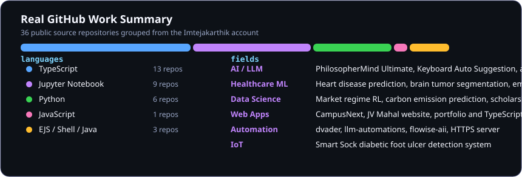

  

<h1 align="center">
  Hi, I'm <a href="https://github.com/Imtejakarthik">Imteja Karthik</a>
  
</h1>

  <b>Computer Science Engineering student specializing in AI and ML</b> 
  Building machine learning projects, web apps, automation tools, and data-driven systems.

  
  
  
  

  

 

  <h3><code>imteja@github ~ $ ./contributions.sh</code></h3>
  

 

  <h3><code>imteja@github ~ $ ./real-work-summary.sh</code></h3>
  

 

  <h3><code>imteja@github ~ $ ls projects-by-field</code></h3>

### AI / LLM

- [PhilosopherMind Ultimate LLM](https://github.com/Imtejakarthik/PhilosopherMind_UltimateLLM) - emotionally intelligent problem-solving LLM architecture.
- [Keyboard Auto Suggestion NLP Project](https://github.com/Imtejakarthik/Keyboard-Auto-Suggestion-NLP-Project) - real-time next-word suggestion using NLP.
- [AI Agent Automation](https://github.com/Imtejakarthik/anti-ai-agent-genrator) - modular AI agent workflow automation system.
- [LLM Automations](https://github.com/Imtejakarthik/llm-automations) - TypeScript automation experiments around LLM workflows.

### Healthcare ML

- [Heart Disease Prediction](https://github.com/Imtejakarthik/Heart-Disease-Prediction-) - ML prediction using clinical heart disease data.
- [Advanced Brain Tumor Segmentation](https://github.com/Imtejakarthik/advance-brain-tumor-segmentation) - deep learning based tumor segmentation from medical images.
- [Live Human Emotion Classification](https://github.com/Imtejakarthik/Live-Human-Emotion-Classification) - emotion classification experiment.
- [Smart Sock IoT](https://github.com/Imtejakarthik/smart_sock_iot) - diabetic foot ulcer monitoring concept with sensors.

### Data Science / Analytics

- [Market Regime Switching RL Agent](https://github.com/Imtejakarthik/market-regime) - reinforcement learning with market regime detection.
- [CO2 Emission Predictive Analysis](https://github.com/Imtejakarthik/CO2-EMSSION) - vehicle carbon emission prediction model.
- [Scholarship Eligibility Analyzer](https://github.com/Imtejakarthik/scholarship-eligibility-analyzer) - local AI-powered scholarship recommendation app.
- [Ekkocare](https://github.com/Imtejakarthik/ekkocare) - real-time analysis notebook project.

### Web Apps / Product UI

- [CampusNext](https://github.com/Imtejakarthik/campusnext) - event management app with Next.js and TypeScript.
- [JV Mahal Website](https://github.com/Imtejakarthik/jv_mahal_website) - Next.js website project.
- [Lora](https://github.com/Imtejakarthik/lora) - TypeScript web application.
- [Maptip](https://github.com/Imtejakarthik/maptip) - EJS web project.

### Automation / Dev Tools

- [dvader](https://github.com/Imtejakarthik/dvader) - JavaScript developer tooling project.
- [Flowise AII](https://github.com/Imtejakarthik/flowise-aii) - Docker-based Flowise AI setup.
- [HTTPS Server](https://github.com/Imtejakarthik/https-sever) - Shell-based HTTPS server experiment.
- [Python Practice](https://github.com/Imtejakarthik/PYTHON) - Python learning and utility scripts.

 

  <h3><code>imteja@github ~ $ cat stack.txt</code></h3>
  <code>Python</code>
  <code>Jupyter Notebook</code>
  <code>TypeScript</code>
  <code>JavaScript</code>
  <code>Next.js</code>
  <code>React</code>
  <code>Node.js</code>
  <code>Docker</code>
  <code>Shell</code>
  <code>EJS</code>

 

  <h3><code>imteja@github ~ $ git activity</code></h3>
  <a href="https://github.com/Imtejakarthik?tab=repositories">View all repositories</a> ·
  <a href="https://github.com/Imtejakarthik?tab=stars">View starred projects</a> ·
  <a href="https://github.com/Imtejakarthik">View GitHub activity</a>

 

  <h3><code>Thanks for visiting. Build something useful today.</code></h3>

