  <h3><code>teja@github ~ $ ./contributions.sh</code></h3>
  
   
   
  <h3><code>teja@github ~ $ whoami</code></h3>
  <table>
    <tr>
      <td valign="top"></td>
      <td valign="top"></td>
    </tr>
  </table>
   
  

    
    
    
    
  

   
  <h3><code>teja@github ~ $ ls projects --group=field</code></h3>
  

  
<b>Project Links</b>

   
  <b>AI / LLM</b> 
  <a href="https://github.com/Imtejakarthik/PhilosopherMind_UltimateLLM">PhilosopherMind Ultimate LLM</a> ·
  <a href="https://github.com/Imtejakarthik/Keyboard-Auto-Suggestion-NLP-Project">Keyboard Auto Suggestion NLP Project</a> ·
  <a href="https://github.com/Imtejakarthik/anti-ai-agent-genrator">AI Agent Automation</a> ·
  <a href="https://github.com/Imtejakarthik/llm-automations">LLM Automations</a>
   
   
  <b>Healthcare ML</b> 
  <a href="https://github.com/Imtejakarthik/Heart-Disease-Prediction-">Heart Disease Prediction</a> ·
  <a href="https://github.com/Imtejakarthik/advance-brain-tumor-segmentation">Advanced Brain Tumor Segmentation</a> ·
  <a href="https://github.com/Imtejakarthik/Live-Human-Emotion-Classification">Live Human Emotion Classification</a> ·
  <a href="https://github.com/Imtejakarthik/smart_sock_iot">Smart Sock IoT</a>
   
   
  <b>Data / Analytics</b> 
  <a href="https://github.com/Imtejakarthik/market-regime">Market Regime Switching RL Agent</a> ·
  <a href="https://github.com/Imtejakarthik/CO2-EMSSION">CO2 Emission Predictive Analysis</a> ·
  <a href="https://github.com/Imtejakarthik/scholarship-eligibility-analyzer">Scholarship Eligibility Analyzer</a> ·
  <a href="https://github.com/Imtejakarthik/ekkocare">Ekkocare</a>
   
   
  <b>Web / Product UI</b> 
  <a href="https://github.com/Imtejakarthik/campusnext">CampusNext</a> ·
  <a href="https://github.com/Imtejakarthik/jv_mahal_website">JV Mahal Website</a> ·
  <a href="https://github.com/Imtejakarthik/lora">Lora</a> ·
  <a href="https://github.com/Imtejakarthik/maptip">Maptip</a>
   
   
  <b>Automation / Tools</b> 
  <a href="https://github.com/Imtejakarthik/dvader">dvader</a> ·
  <a href="https://github.com/Imtejakarthik/flowise-aii">Flowise AII</a> ·
  <a href="https://github.com/Imtejakarthik/https-sever">HTTPS Server</a> ·
  <a href="https://github.com/Imtejakarthik/PYTHON">Python Practice</a>

   
  <h3><code>teja@github ~ $ open</code></h3>
  <a href="https://github.com/Imtejakarthik?tab=repositories"><b>View repositories</b></a>
  ·
  <a href="https://github.com/Imtejakarthik?tab=stars"><b>View starred projects</b></a>
  ·
  <a href="https://github.com/Imtejakarthik">View GitHub activity</a>

