  

<h1 align="center">
  Hi, I'm <a href="https://github.com/Imtejakarthik">Imteja Karthik</a>
  
</h1>

  <b>Full-stack developer</b> building AI-powered tools, polished web apps, and automation systems.

  
  
  
  
  

  

 

  <h3><code>imteja@github ~ $ ./contributions.sh</code></h3>
  

 

  <h3><code>imteja@github ~ $ ls featured-projects</code></h3>

<table align="center">
  <tr>
    <td width="50%" valign="top">
      <h3 align="center">AI Stackflow</h3>
      
AI-assisted workflow and productivity experiments.

      
<a href="https://ai-stackflow.vercel.app">Open project</a>

    </td>
    <td width="50%" valign="top">
      <h3 align="center">Byteforge Labs</h3>
      
A lab space for useful web tools and product ideas.

      
<a href="https://byteforge-labs.vercel.app">Open project</a>

    </td>
  </tr>
  <tr>
    <td width="50%" valign="top">
      <h3 align="center">NeuronHub AI</h3>
      
AI interface concepts and practical agent workflows.

      
<a href="https://neuronhub-ai.vercel.app">Open project</a>

    </td>
    <td width="50%" valign="top">
      <h3 align="center">Devverse Tools</h3>
      
Developer utilities focused on speed and clarity.

      
<a href="https://devverse-tools.vercel.app">Open project</a>

    </td>
  </tr>
  <tr>
    <td width="50%" valign="top">
      <h3 align="center">Project Zero X</h3>
      
Experimental product builds from zero to shipped.

      
<a href="https://project-zero-x.vercel.app">Open project</a>

    </td>
    <td width="50%" valign="top">
      <h3 align="center">Autonoma OS</h3>
      
Automation-first systems and operating ideas.

      
<a href="https://autonoma-os.vercel.app">Open project</a>

    </td>
  </tr>
</table>

 

  <h3><code>imteja@github ~ $ cat stack.txt</code></h3>
  

 

  <h3><code>imteja@github ~ $ ./stats.sh</code></h3>
  
  

 

  

 

  <h3><code>imteja@github ~ $ ./activity.sh</code></h3>
  

 

  <h3><code>Thanks for visiting. Build something useful today.</code></h3>

